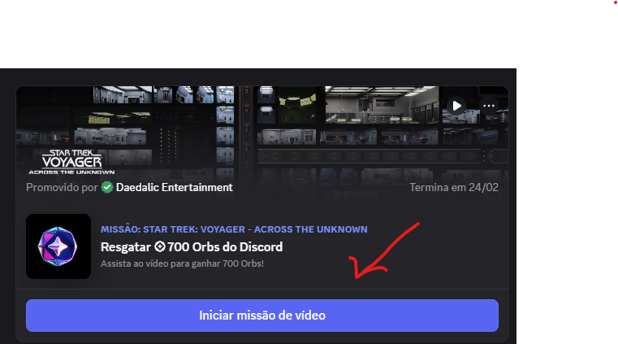

<div align="center">
  
  
  <h1 style="font-size:2.5em; color:#5865F2; margin-bottom:0.2em;">AutoComplete</h1>
  <p style="font-size:1.2em; color:#23272A; font-weight:bold;">
    Automatize missões do Discord (games e vídeos) de forma rápida e prática!
  </p>
  <br>
  <a href="CREDS.md" style="font-size:1.1em; color:#5865F2; font-weight:bold;">
    → Créditos & Referências
  </a>
</div>

---

<div align="center">
  
  
  
</div>

---

## ⚠️ Aviso Importante

> **Não me responsabilizo em caso de ban em sua conta.**
>
> Por mais que não tenha nenhum banimento apurado, teoricamente usar automações assim é contra a ToS do Discord. Use por sua conta e risco.

---

## 🚀 Como usar?

1. **Instale a versão de testes do Discord:** https://ptb.discord.com/

2. **Abra o DevTools:** Após instalar o app, faça login em sua conta.  
   Pressione `Ctrl + Shift + I` para abrir o console/DevTools.

3. **Permita colar scripts:** No DevTools, digite:

   ```
   allow pasting
   ```

4. **Cole o script abaixo:**

<details>
 <summary>Script</summary>

```js
(function () {
    'use strict';

    const QuestHelperConfig = {
        version: '0.1.4',
        supportedTasks: ['WATCH_VIDEO', 'PLAY_ON_DESKTOP', 'STREAM_ON_DESKTOP', 'PLAY_ACTIVITY', 'WATCH_VIDEO_ON_MOBILE'],
        taskLabels: {
            WATCH_VIDEO: 'Vídeo',
            PLAY_ON_DESKTOP: 'Desktop',
            STREAM_ON_DESKTOP: 'Stream',
            PLAY_ACTIVITY: 'Atividade',
            WATCH_VIDEO_ON_MOBILE: 'Mobile'
        },
        refreshInterval: 30000,
        heartbeatInterval: 20000,
        maxRetries: 3,
        logoUrl: 'https://i.imgur.com/nYORXlL.png'
    };

    const QuestHelperUtils = {
        formatTime(seconds) {
            if (!seconds || seconds < 0) return '0s';
            const mins = Math.floor(seconds / 60);
            const secs = Math.floor(seconds % 60);
            return mins > 0 ? `${mins}m ${secs}s` : `${secs}s`;
        },

        showMessage(text, type = 'info', statusElements) {
            if (statusElements) {
                statusElements.text.textContent = text;
                statusElements.dot.className = 'qh-status-dot' +
                    (type === 'success' ? ' ok' : type === 'error' ? ' err' : '');
            }
        },

        async sleep(ms) {
            return new Promise(resolve => setTimeout(resolve, ms));
        },

        getModule(filter) {
            try {
                const wpRequire = webpackChunkdiscord_app.push([[Symbol()], {}, r => r]);
                webpackChunkdiscord_app.pop();
                return Object.values(wpRequire?.c || {}).find(filter)?.exports;
            } catch (e) {
                console.debug('[Quest Helper] Erro ao acessar webpack:', e);
                return null;
            }
        },

        loadStores() {
            let ApplicationStreamingStore, RunningGameStore, QuestsStore,
                ChannelStore, GuildChannelStore, FluxDispatcher, api;

            ApplicationStreamingStore = this.getModule(
                x => x?.exports?.Z?.__proto__?.getStreamerActiveStreamMetadata
            )?.Z;

            if (!ApplicationStreamingStore) {
                ApplicationStreamingStore = this.getModule(x => x?.exports?.A?.__proto__?.getStreamerActiveStreamMetadata)?.A;
                RunningGameStore          = this.getModule(x => x?.exports?.Ay?.getRunningGames)?.Ay;
                QuestsStore               = this.getModule(x => x?.exports?.A?.__proto__?.getQuest)?.A;
                ChannelStore              = this.getModule(x => x?.exports?.A?.__proto__?.getAllThreadsForParent)?.A;
                GuildChannelStore         = this.getModule(x => x?.exports?.Ay?.getSFWDefaultChannel)?.Ay;
                FluxDispatcher            = this.getModule(x => x?.exports?.h?.__proto__?.flushWaitQueue)?.h;
                api                       = this.getModule(x => x?.exports?.Bo?.get)?.Bo;
            } else {
                RunningGameStore  = this.getModule(x => x?.exports?.ZP?.getRunningGames)?.ZP;
                QuestsStore       = this.getModule(x => x?.exports?.Z?.__proto__?.getQuest)?.Z;
                ChannelStore      = this.getModule(x => x?.exports?.Z?.__proto__?.getAllThreadsForParent)?.Z;
                GuildChannelStore = this.getModule(x => x?.exports?.ZP?.getSFWDefaultChannel)?.ZP;
                FluxDispatcher    = this.getModule(x => x?.exports?.Z?.__proto__?.flushWaitQueue)?.Z;
                api               = this.getModule(x => x?.exports?.tn?.get)?.tn;
            }

            return { ApplicationStreamingStore, RunningGameStore, QuestsStore, ChannelStore, GuildChannelStore, FluxDispatcher, api };
        },

        getUsername() {
            try {
                const UserStore =
                    this.getModule(x => x?.exports?.Z?.__proto__?.getCurrentUser)?.Z ||
                    this.getModule(x => x?.exports?.A?.__proto__?.getCurrentUser)?.A ||
                    this.getModule(x => x?.exports?.default?.__proto__?.getCurrentUser)?.default;
                if (!UserStore) return null;
                const user = UserStore.getCurrentUser();
                return user?.globalName || user?.username || null;
            } catch (e) {
                return null;
            }
        }
    };

    const LOGO_URL = QuestHelperConfig.logoUrl;
    const LOGO_NAV = ``;
    const LOGO_HDR = ``;

    const LU = {
        play:      `<svg width="14" height="14" viewBox="0 0 24 24" fill="currentColor" stroke="none"><polygon points="5 3 19 12 5 21 5 3"/></svg>`,
        refreshCw: `<svg width="14" height="14" viewBox="0 0 24 24" fill="none" stroke="currentColor" stroke-width="2.2" stroke-linecap="round" stroke-linejoin="round"><path d="M3 12a9 9 0 0 1 9-9 9.75 9.75 0 0 1 6.74 2.74L21 8"/><path d="M21 3v5h-5"/><path d="M21 12a9 9 0 0 1-9 9 9.75 9.75 0 0 1-6.74-2.74L3 16"/><path d="M8 16H3v5"/></svg>`,
        minus:     `<svg width="14" height="14" viewBox="0 0 24 24" fill="none" stroke="currentColor" stroke-width="2.5" stroke-linecap="round"><line x1="5" y1="12" x2="19" y2="12"/></svg>`,
        x:         `<svg width="14" height="14" viewBox="0 0 24 24" fill="none" stroke="currentColor" stroke-width="2.5" stroke-linecap="round"><line x1="18" y1="6" x2="6" y2="18"/><line x1="6" y1="6" x2="18" y2="18"/></svg>`,
        video:     `<svg width="12" height="12" viewBox="0 0 24 24" fill="none" stroke="currentColor" stroke-width="2" stroke-linecap="round" stroke-linejoin="round"><path d="m22 8-6 4 6 4V8Z"/><rect width="14" height="12" x="2" y="6" rx="2" ry="2"/></svg>`,
        monitor:   `<svg width="12" height="12" viewBox="0 0 24 24" fill="none" stroke="currentColor" stroke-width="2" stroke-linecap="round" stroke-linejoin="round"><rect width="20" height="14" x="2" y="3" rx="2"/><path d="M8 21h8"/><path d="M12 17v4"/></svg>`,
        cast:      `<svg width="12" height="12" viewBox="0 0 24 24" fill="none" stroke="currentColor" stroke-width="2" stroke-linecap="round" stroke-linejoin="round"><path d="M2 8V6a2 2 0 0 1 2-2h16a2 2 0 0 1 2 2v12a2 2 0 0 1-2 2h-6"/><path d="M2 12a9 9 0 0 1 8 8"/><path d="M2 16a5 5 0 0 1 4 4"/><line x1="2" y1="20" x2="2.01" y2="20"/></svg>`,
        activity:  `<svg width="12" height="12" viewBox="0 0 24 24" fill="none" stroke="currentColor" stroke-width="2" stroke-linecap="round" stroke-linejoin="round"><polyline points="22 12 18 12 15 21 9 3 6 12 2 12"/></svg>`,
        smartphone:`<svg width="12" height="12" viewBox="0 0 24 24" fill="none" stroke="currentColor" stroke-width="2" stroke-linecap="round" stroke-linejoin="round"><rect width="14" height="20" x="5" y="2" rx="2" ry="2"/><path d="M12 18h.01"/></svg>`,
        layers:    `<svg width="40" height="40" viewBox="0 0 24 24" fill="none" stroke="currentColor" stroke-width="1.2" stroke-linecap="round" stroke-linejoin="round"><polygon points="12 2 2 7 12 12 22 7 12 2"/><polyline points="2 17 12 22 22 17"/><polyline points="2 12 12 17 22 12"/></svg>`,
        zap:       `<svg width="10" height="10" viewBox="0 0 24 24" fill="currentColor" stroke="none"><polygon points="13 2 3 14 12 14 11 22 21 10 12 10 13 2"/></svg>`
    };

    const taskIcons = {
        WATCH_VIDEO:          LU.video,
        PLAY_ON_DESKTOP:      LU.monitor,
        STREAM_ON_DESKTOP:    LU.cast,
        PLAY_ACTIVITY:        LU.activity,
        WATCH_VIDEO_ON_MOBILE:LU.smartphone
    };

    function injectStyles() {
        const style = document.createElement('style');
        style.textContent = `
            :root {
                --qh-font: 'gg sans', 'Noto Sans', 'Helvetica Neue', Arial, sans-serif;
                --qh-base: rgba(8, 9, 14, 0.72);
                --qh-surface: rgba(255, 255, 255, 0.038);
                --qh-surface-hov: rgba(255, 255, 255, 0.065);
                --qh-border: rgba(255, 255, 255, 0.072);
                --qh-border-strong: rgba(255, 255, 255, 0.13);
                --qh-shine: rgba(255, 255, 255, 0.055);
                --qh-rim: rgba(160, 175, 255, 0.12);
                --qh-shadow-out: 6px 6px 16px rgba(0,0,0,0.55), -3px -3px 10px rgba(255,255,255,0.025);
                --qh-shadow-in: inset 3px 3px 8px rgba(0,0,0,0.5), inset -2px -2px 6px rgba(255,255,255,0.03);
                --qh-accent: #7c88ff;
                --qh-accent-dim: rgba(124, 136, 255, 0.22);
                --qh-accent-glow: rgba(124, 136, 255, 0.35);
                --qh-accent-fg: #a8b1ff;
                --qh-ok: #4ade80;
                --qh-ok-dim: rgba(74, 222, 128, 0.18);
                --qh-err: #f87171;
                --qh-err-dim: rgba(248, 113, 113, 0.18);
                --qh-text: rgba(240, 242, 255, 0.92);
                --qh-muted: rgba(180, 185, 220, 0.55);
                --qh-r-panel: 22px;
                --qh-r-card: 16px;
                --qh-r-sm: 10px;
                --qh-blur: blur(28px) saturate(160%);
                --qh-ease: cubic-bezier(0.22, 1, 0.36, 1);
            }

            .qh-nav-icon {
                display: inline-flex; align-items: center; justify-content: center;
                width: 32px; height: 32px; padding: 0; margin: 0 1px;
                border-radius: 8px; cursor: pointer; background: transparent;
                transition: background 0.18s var(--qh-ease), box-shadow 0.18s var(--qh-ease), transform 0.15s var(--qh-ease);
                position: relative; flex-shrink: 0; vertical-align: middle;
            }
            .qh-nav-icon img { width: 20px; height: 20px; display: block; object-fit: contain; border-radius: 3px; opacity: 0.75; transition: opacity 0.18s, transform 0.18s var(--qh-ease); }
            .qh-nav-icon:hover img { opacity: 1; transform: scale(1.06); }
            .qh-nav-icon.active img { opacity: 1; }
            .qh-nav-icon:hover { background: rgba(255,255,255,0.08); box-shadow: 0 4px 14px rgba(0,0,0,0.35); }
            .qh-nav-icon.active { background: var(--qh-accent-dim); box-shadow: 0 0 0 1px var(--qh-rim), 0 6px 18px var(--qh-accent-glow); }
            .qh-nav-badge {
                position: absolute; top: 5px; right: 5px;
                background: linear-gradient(135deg, #f87171, #ef4444); color: #fff;
                font-family: var(--qh-font); font-size: 9px; font-weight: 800;
                min-width: 16px; height: 16px; border-radius: 8px;
                display: flex; align-items: center; justify-content: center;
                padding: 0 3px; border: 2px solid #1a1b22;
                box-shadow: 0 3px 8px rgba(239,68,68,0.4);
                animation: qhBadgePop 0.35s var(--qh-ease);
            }
            @keyframes qhBadgePop {
                0% { transform: scale(0) rotate(-20deg); }
                65% { transform: scale(1.15) rotate(4deg); }
                100% { transform: scale(1) rotate(0); }
            }

            .qh-panel {
                position: fixed; top: 66px; right: 18px; width: 354px;
                font-family: var(--qh-font); font-size: 13px; color: var(--qh-text); z-index: 9999;
                border-radius: var(--qh-r-panel); overflow: hidden;
                background: var(--qh-base); backdrop-filter: var(--qh-blur); -webkit-backdrop-filter: var(--qh-blur);
                border: 1px solid var(--qh-border);
                box-shadow: 0 0 0 0.5px var(--qh-rim), 0 32px 64px -16px rgba(0,0,0,0.8), 0 8px 24px -8px rgba(0,0,0,0.6), inset 0 1px 0 var(--qh-shine);
                transition: opacity 0.22s var(--qh-ease), transform 0.28s var(--qh-ease);
                animation: qhPanelIn 0.32s var(--qh-ease);
            }
            .qh-panel.qh-dragging { opacity: 0.92; transition: none; box-shadow: 0 48px 80px -16px rgba(0,0,0,0.9), 0 0 0 0.5px var(--qh-rim); }
            .qh-panel.qh-minimized { display: none; }
            @keyframes qhPanelIn {
                from { opacity: 0; transform: translateY(-14px) scale(0.97); }
                to   { opacity: 1; transform: translateY(0) scale(1); }
            }
            .qh-panel::before {
                content: ''; position: absolute; top: 0; left: 0; right: 0; height: 1px;
                background: linear-gradient(90deg, transparent 5%, rgba(255,255,255,0.18) 30%, rgba(255,255,255,0.28) 50%, rgba(255,255,255,0.18) 70%, transparent 95%);
                border-radius: var(--qh-r-panel) var(--qh-r-panel) 0 0; pointer-events: none;
            }

            .qh-header {
                display: flex; align-items: center; gap: 11px; padding: 16px 18px 15px;
                cursor: move; user-select: none; border-bottom: 1px solid var(--qh-border);
                background: linear-gradient(180deg, rgba(255,255,255,0.028) 0%, transparent 100%);
            }
            .qh-logo {
                width: 38px; height: 38px; border-radius: 11px; background: rgba(255,255,255,0.06);
                display: flex; align-items: center; justify-content: center; border: 1px solid rgba(255,255,255,0.1);
                box-shadow: 0 6px 18px rgba(0,0,0,0.35), inset 0 1px 0 rgba(255,255,255,0.12), inset 0 -1px 0 rgba(0,0,0,0.15);
                flex-shrink: 0; transition: transform 0.25s var(--qh-ease), box-shadow 0.25s var(--qh-ease); overflow: hidden;
            }
            .qh-logo img { width: 22px; height: 22px; object-fit: contain; border-radius: 4px; display: block; }
            .qh-header:hover .qh-logo { transform: rotate(8deg) scale(1.04); box-shadow: 0 10px 28px rgba(0,0,0,0.45), inset 0 1px 0 rgba(255,255,255,0.18); }
            .qh-title-block { flex: 1; min-width: 0; }
            .qh-title { font-size: 15px; font-weight: 800; letter-spacing: 0.2px; color: var(--qh-text); line-height: 1.2; }
            .qh-version { font-size: 10px; font-weight: 600; color: var(--qh-muted); letter-spacing: 0.5px; margin-top: 2px; text-transform: uppercase; }
            .qh-hdr-actions { display: flex; gap: 5px; }
            .qh-hdr-btn {
                background: var(--qh-surface); border: 1px solid var(--qh-border); color: var(--qh-muted);
                width: 32px; height: 32px; border-radius: 9px; display: flex; align-items: center; justify-content: center;
                cursor: pointer; transition: all 0.18s var(--qh-ease); box-shadow: var(--qh-shadow-out);
            }
            .qh-hdr-btn:hover {
                background: var(--qh-surface-hov); color: var(--qh-text); border-color: var(--qh-border-strong);
                transform: translateY(-1px); box-shadow: 0 6px 16px rgba(0,0,0,0.45), -1px -1px 4px rgba(255,255,255,0.025);
            }

            .qh-content { padding: 16px 16px 0; }
            .qh-stats { display: grid; grid-template-columns: repeat(3, 1fr); gap: 8px; margin-bottom: 16px; }
            .qh-stat {
                background: var(--qh-surface); border: 1px solid var(--qh-border); border-radius: var(--qh-r-sm);
                padding: 12px 8px; text-align: center; box-shadow: var(--qh-shadow-in);
                transition: background 0.18s, border-color 0.18s, transform 0.18s var(--qh-ease);
            }
            .qh-stat:hover { background: var(--qh-surface-hov); border-color: var(--qh-border-strong); transform: translateY(-2px); }
            .qh-stat-val { font-size: 24px; font-weight: 800; color: var(--qh-text); line-height: 1.1; letter-spacing: -0.5px; }
            .qh-stat-lbl { font-size: 9.5px; font-weight: 700; text-transform: uppercase; letter-spacing: 0.8px; color: var(--qh-muted); margin-top: 3px; }

            .qh-list {
                max-height: 330px; overflow-y: auto; margin-bottom: 14px; padding-right: 2px;
                scrollbar-width: thin; scrollbar-color: rgba(124,136,255,0.2) transparent;
            }
            .qh-list::-webkit-scrollbar { width: 4px; }
            .qh-list::-webkit-scrollbar-track { background: transparent; }
            .qh-list::-webkit-scrollbar-thumb { background: rgba(124,136,255,0.25); border-radius: 4px; }
            .qh-list::-webkit-scrollbar-thumb:hover { background: rgba(124,136,255,0.45); }

            .qh-card {
                background: var(--qh-surface); border: 1px solid var(--qh-border); border-radius: var(--qh-r-card);
                padding: 14px; margin-bottom: 9px;
                box-shadow: 4px 4px 12px rgba(0,0,0,0.45), -2px -2px 8px rgba(255,255,255,0.022), inset 0 1px 0 rgba(255,255,255,0.05);
                transition: all 0.22s var(--qh-ease); animation: qhCardIn 0.3s var(--qh-ease) both;
            }
            .qh-card:nth-child(2) { animation-delay: 0.04s; }
            .qh-card:nth-child(3) { animation-delay: 0.08s; }
            .qh-card:nth-child(4) { animation-delay: 0.12s; }
            @keyframes qhCardIn {
                from { opacity: 0; transform: translateY(10px); }
                to   { opacity: 1; transform: translateY(0); }
            }
            .qh-card:hover {
                background: var(--qh-surface-hov); border-color: rgba(124,136,255,0.28); transform: translateY(-2px);
                box-shadow: 6px 6px 18px rgba(0,0,0,0.55), -2px -2px 8px rgba(255,255,255,0.028), 0 0 0 1px rgba(124,136,255,0.15), inset 0 1px 0 rgba(255,255,255,0.07);
            }
            .qh-card-top { display: flex; align-items: center; gap: 10px; margin-bottom: 12px; }
            .qh-game-icon {
                width: 34px; height: 34px; border-radius: 9px;
                background: linear-gradient(145deg, rgba(255,255,255,0.06) 0%, rgba(255,255,255,0.02) 100%);
                border: 1px solid var(--qh-border-strong); display: flex; align-items: center; justify-content: center;
                font-size: 13px; font-weight: 800; color: var(--qh-muted); text-transform: uppercase;
                box-shadow: inset 2px 2px 5px rgba(0,0,0,0.4), inset -1px -1px 3px rgba(255,255,255,0.02); flex-shrink: 0;
            }
            .qh-game-name { flex: 1; font-size: 13.5px; font-weight: 700; color: var(--qh-text); white-space: nowrap; overflow: hidden; text-overflow: ellipsis; }
            .qh-task-chip {
                display: inline-flex; align-items: center; gap: 5px; padding: 4px 9px;
                border-radius: 20px; font-size: 10px; font-weight: 800; letter-spacing: 0.4px; text-transform: uppercase;
                color: var(--qh-accent-fg); background: var(--qh-accent-dim); border: 1px solid rgba(124,136,255,0.3);
                box-shadow: 0 3px 8px rgba(124,136,255,0.15); white-space: nowrap; flex-shrink: 0;
            }
            .qh-task-chip svg { opacity: 0.85; }

            .qh-progress-row { display: flex; justify-content: space-between; font-size: 10.5px; font-weight: 600; color: var(--qh-muted); margin-bottom: 7px; }
            .qh-bar-track { height: 5px; border-radius: 6px; background: rgba(0,0,0,0.35); box-shadow: inset 1px 1px 3px rgba(0,0,0,0.5); overflow: hidden; }
            .qh-bar-fill {
                height: 100%; border-radius: 6px;
                background: linear-gradient(90deg, #6272f0, #a0acff);
                box-shadow: 0 0 10px rgba(124,136,255,0.5);
                transition: width 0.5s cubic-bezier(0.34, 1.56, 0.64, 1);
            }

            .qh-footer { display: flex; gap: 9px; padding: 0 16px 16px; }
            .qh-btn {
                flex: 1; padding: 11px 12px; border: none; border-radius: var(--qh-r-sm);
                font-family: var(--qh-font); font-size: 13px; font-weight: 800; cursor: pointer;
                display: flex; align-items: center; justify-content: center; gap: 7px; letter-spacing: 0.3px;
                transition: all 0.2s var(--qh-ease);
            }
            .qh-btn-primary {
                background: linear-gradient(145deg, #5a6aee, #7c88ff); color: rgba(255,255,255,0.95);
                border: 1px solid rgba(255,255,255,0.1);
                box-shadow: 0 8px 22px rgba(100,116,255,0.4), inset 0 1px 0 rgba(255,255,255,0.2), inset 0 -1px 0 rgba(0,0,0,0.15);
            }
            .qh-btn-primary:hover:not(:disabled) { transform: translateY(-2px); box-shadow: 0 14px 32px rgba(100,116,255,0.55), inset 0 1px 0 rgba(255,255,255,0.25); filter: brightness(1.08); }
            .qh-btn-primary:active:not(:disabled) { transform: translateY(0); box-shadow: 0 4px 12px rgba(100,116,255,0.35); }
            .qh-btn-primary:disabled { opacity: 0.35; cursor: not-allowed; }
            .qh-btn-icon { flex: none; width: 44px; background: var(--qh-surface); color: var(--qh-muted); border: 1px solid var(--qh-border); box-shadow: var(--qh-shadow-out); }
            .qh-btn-icon:hover { background: var(--qh-surface-hov); color: var(--qh-text); border-color: var(--qh-border-strong); transform: translateY(-2px) rotate(45deg); box-shadow: 0 8px 20px rgba(0,0,0,0.45); }

            .qh-status {
                display: flex; align-items: center; gap: 8px; padding: 10px 18px;
                border-top: 1px solid var(--qh-border); background: rgba(0,0,0,0.18);
                font-size: 11.5px; font-weight: 600; color: var(--qh-muted);
            }
            .qh-status-dot {
                width: 7px; height: 7px; border-radius: 50%; background: var(--qh-accent);
                box-shadow: 0 0 8px var(--qh-accent-glow);
                animation: qhPulse 2.4s ease-in-out infinite; flex-shrink: 0;
            }
            .qh-status-dot.ok  { background: var(--qh-ok);  box-shadow: 0 0 8px rgba(74,222,128,0.4); }
            .qh-status-dot.err { background: var(--qh-err); box-shadow: 0 0 8px rgba(248,113,113,0.4); animation: none; }
            @keyframes qhPulse {
                0%, 100% { opacity: 0.55; transform: scale(1); }
                50%       { opacity: 1;    transform: scale(1.25); }
            }

            .qh-empty {
                padding: 44px 20px; text-align: center; color: var(--qh-muted);
                display: flex; flex-direction: column; align-items: center; gap: 11px; animation: qhFadeIn 0.3s;
            }
            .qh-empty svg { opacity: 0.28; }
            .qh-empty-title { font-size: 13px; font-weight: 700; color: rgba(200,205,240,0.45); }
            .qh-empty-sub   { font-size: 11px; font-weight: 600; color: var(--qh-muted); opacity: 0.7; }
            @keyframes qhFadeIn {
                from { opacity: 0; transform: translateY(6px); }
                to   { opacity: 1; transform: translateY(0); }
            }

            .qh-boot {
                position: fixed; top: 66px; right: 18px; width: 354px;
                font-family: var(--qh-font); color: var(--qh-text); z-index: 10000;
                border-radius: var(--qh-r-panel); overflow: hidden;
                background: var(--qh-base); backdrop-filter: var(--qh-blur); -webkit-backdrop-filter: var(--qh-blur);
                border: 1px solid var(--qh-border);
                box-shadow: 0 0 0 0.5px var(--qh-rim), 0 32px 64px -16px rgba(0,0,0,0.8), 0 8px 24px -8px rgba(0,0,0,0.6), inset 0 1px 0 var(--qh-shine);
                animation: qhPanelIn 0.32s var(--qh-ease);
            }
            .qh-boot::before {
                content: ''; position: absolute; top: 0; left: 0; right: 0; height: 1px;
                background: linear-gradient(90deg, transparent 5%, rgba(255,255,255,0.18) 30%, rgba(255,255,255,0.28) 50%, rgba(255,255,255,0.18) 70%, transparent 95%);
                border-radius: var(--qh-r-panel) var(--qh-r-panel) 0 0; pointer-events: none;
            }

            .qh-boot-header {
                display: flex; align-items: center; gap: 11px; padding: 16px 18px 15px;
                border-bottom: 1px solid var(--qh-border);
                background: linear-gradient(180deg, rgba(255,255,255,0.028) 0%, transparent 100%);
            }
            .qh-boot-logo {
                width: 38px; height: 38px; border-radius: 11px; background: rgba(255,255,255,0.06);
                display: flex; align-items: center; justify-content: center; border: 1px solid rgba(255,255,255,0.1);
                box-shadow: 0 6px 18px rgba(0,0,0,0.35), inset 0 1px 0 rgba(255,255,255,0.12), inset 0 -1px 0 rgba(0,0,0,0.15);
                flex-shrink: 0; overflow: hidden;
            }
            .qh-boot-logo img { width: 22px; height: 22px; object-fit: contain; border-radius: 4px; display: block; }
            .qh-boot-title { font-size: 15px; font-weight: 800; letter-spacing: 0.2px; }
            .qh-boot-sub { font-size: 10px; font-weight: 600; color: var(--qh-muted); letter-spacing: 0.5px; text-transform: uppercase; margin-top: 2px; }

            .qh-boot-body { padding: 22px 20px 20px; }

            .qh-load-label {
                display: flex; justify-content: space-between; align-items: center;
                font-size: 11px; font-weight: 600; color: var(--qh-muted); margin-bottom: 10px; letter-spacing: 0.3px;
            }
            .qh-load-label span:last-child { color: var(--qh-accent-fg); font-weight: 700; font-size: 11px; }

            .qh-load-track {
                height: 6px; border-radius: 8px; background: rgba(0,0,0,0.4);
                box-shadow: inset 1px 1px 4px rgba(0,0,0,0.6); overflow: hidden; position: relative;
            }
            .qh-load-fill {
                height: 100%; border-radius: 8px; width: 0%;
                background: linear-gradient(90deg, #5a6aee, #7c88ff, #a0acff);
                box-shadow: 0 0 14px rgba(124,136,255,0.7);
                transition: width 0.12s ease-out;
                position: relative; overflow: hidden;
            }
            .qh-load-fill::after {
                content: '';
                position: absolute; top: 0; left: -60%; width: 60%; height: 100%;
                background: linear-gradient(90deg, transparent, rgba(255,255,255,0.35), transparent);
                animation: qhShimmer 1.2s ease-in-out infinite;
            }
            @keyframes qhShimmer {
                0% { left: -60%; }
                100% { left: 120%; }
            }

            .qh-load-steps {
                margin-top: 16px; display: flex; flex-direction: column; gap: 6px;
            }
            .qh-load-step {
                display: flex; align-items: center; gap: 9px;
                font-size: 11.5px; font-weight: 600; color: var(--qh-muted);
                transition: color 0.25s ease, opacity 0.25s ease;
                opacity: 0.4;
            }
            .qh-load-step.active { color: var(--qh-text); opacity: 1; }
            .qh-load-step.done   { color: var(--qh-ok);   opacity: 0.7; }
            .qh-load-step-dot {
                width: 6px; height: 6px; border-radius: 50%; flex-shrink: 0;
                background: currentColor;
                transition: all 0.25s ease;
            }
            .qh-load-step.active .qh-load-step-dot {
                background: var(--qh-accent);
                box-shadow: 0 0 8px var(--qh-accent-glow);
                animation: qhPulse 1.2s ease-in-out infinite;
            }
            .qh-load-step.done .qh-load-step-dot { background: var(--qh-ok); box-shadow: 0 0 6px rgba(74,222,128,0.5); }

            .qh-welcome-body { padding: 28px 20px 0; }

            .qh-typing-wrap {
                min-height: 56px;
                display: flex; align-items: center; justify-content: center;
                text-align: center;
            }
            .qh-typing-text {
                font-size: 17px; font-weight: 700; color: var(--qh-text);
                line-height: 1.45; letter-spacing: 0.1px;
            }
            .qh-typing-cursor {
                display: inline-block; width: 2px; height: 1.1em;
                background: var(--qh-accent); margin-left: 2px; vertical-align: text-bottom;
                border-radius: 1px;
                animation: qhBlink 0.85s step-end infinite;
            }
            @keyframes qhBlink {
                0%, 100% { opacity: 1; }
                50%       { opacity: 0; }
            }

            .qh-lang-label {
                font-size: 10px; font-weight: 700; letter-spacing: 0.8px; text-transform: uppercase;
                color: var(--qh-muted); margin: 20px 0 8px; padding: 0 2px;
            }

            .qh-lang-list {
                border-radius: 14px; overflow: hidden;
                border: 1px solid var(--qh-border);
                background: var(--qh-surface);
                box-shadow: var(--qh-shadow-in);
                margin-bottom: 20px;
            }
            .qh-lang-item {
                display: flex; align-items: center; justify-content: space-between;
                padding: 13px 16px; cursor: pointer;
                transition: background 0.15s ease;
                border-bottom: 1px solid var(--qh-border);
                position: relative;
            }
            .qh-lang-item:last-child { border-bottom: none; }
            .qh-lang-item:hover { background: var(--qh-surface-hov); }
            .qh-lang-item:active { background: rgba(124,136,255,0.12); }

            .qh-lang-left { display: flex; align-items: center; gap: 11px; }
            .qh-lang-flag {
                font-size: 20px; line-height: 1; width: 28px; text-align: center;
                filter: drop-shadow(0 1px 3px rgba(0,0,0,0.4));
            }
            .qh-lang-name {
                font-size: 13.5px; font-weight: 600; color: var(--qh-text);
            }
            .qh-lang-native {
                font-size: 11px; font-weight: 500; color: var(--qh-muted); margin-top: 1px;
            }

            .qh-lang-check {
                width: 20px; height: 20px; border-radius: 50%;
                border: 2px solid var(--qh-border-strong);
                display: flex; align-items: center; justify-content: center;
                transition: all 0.18s var(--qh-ease);
                flex-shrink: 0;
            }
            .qh-lang-item.selected .qh-lang-check {
                background: var(--qh-accent);
                border-color: var(--qh-accent);
                box-shadow: 0 0 10px var(--qh-accent-glow);
            }
            .qh-lang-item.selected .qh-lang-check::after {
                content: '';
                width: 6px; height: 6px; border-radius: 50%; background: #fff;
            }
            .qh-lang-item.selected .qh-lang-name { color: var(--qh-accent-fg); }

            .qh-welcome-footer {
                padding: 0 20px 20px;
            }
            .qh-welcome-btn {
                width: 100%; padding: 13px; border: none; border-radius: var(--qh-r-sm);
                font-family: var(--qh-font); font-size: 13.5px; font-weight: 800;
                cursor: pointer; letter-spacing: 0.3px;
                background: linear-gradient(145deg, #5a6aee, #7c88ff); color: rgba(255,255,255,0.95);
                border: 1px solid rgba(255,255,255,0.1);
                box-shadow: 0 8px 22px rgba(100,116,255,0.4), inset 0 1px 0 rgba(255,255,255,0.2);
                transition: all 0.2s var(--qh-ease);
                opacity: 0.4; pointer-events: none;
            }
            .qh-welcome-btn.ready { opacity: 1; pointer-events: auto; }
            .qh-welcome-btn.ready:hover { transform: translateY(-2px); box-shadow: 0 14px 32px rgba(100,116,255,0.55); filter: brightness(1.08); }
            .qh-welcome-btn.ready:active { transform: translateY(0); }

            .qh-boot-exit {
                opacity: 0; transform: translateY(-8px) scale(0.98);
                transition: opacity 0.22s var(--qh-ease), transform 0.22s var(--qh-ease);
                pointer-events: none;
            }
        `;
        document.head.appendChild(style);
    }

    function findNavBar() {
        const selectors = [
            '[class*="guilds"] ~ div [class*="toolbar"]',
            '[class*="guilds"] + div [class*="children"] [class*="toolbar"]',
            '[class*="sidebar"] + div [class*="children"] [class*="toolbar"]',
            '[class*="chat"] > div > div [class*="toolbar"]',
            '[class*="base"] [class*="toolbar"]',
            '[class*="guilds"] + div [class*="toolbar"]',
            '[class*="chat"] [class*="toolbar"]'
        ];
        for (const sel of selectors) {
            const el = document.querySelector(sel);
            if (el) return el;
        }
        return document.querySelector('[class*="toolbar"]') || document.querySelector('[class*="children"]');
    }

    function createNavIcon(onIconClick) {
        const iconContainer = document.createElement('div');
        iconContainer.className = 'qh-nav-icon';
        iconContainer.id = 'qhNavIcon';
        iconContainer.innerHTML = LOGO_NAV;
        iconContainer.setAttribute('aria-label', 'Quest Helper');
        iconContainer.setAttribute('role', 'button');

        const badge = document.createElement('span');
        badge.className = 'qh-nav-badge';
        badge.style.display = 'none';
        iconContainer.appendChild(badge);

        iconContainer.addEventListener('click', onIconClick);

        function insertIcon() {
            const navBar = findNavBar();
            if (navBar) {
                if (navBar.contains(iconContainer)) return;
                if (iconContainer.parentNode) iconContainer.parentNode.removeChild(iconContainer);
                const profileIcon = navBar.querySelector('[class*="avatar"], [class*="account"], [class*="help"], [class*="question"]');
                if (profileIcon) navBar.insertBefore(iconContainer, profileIcon);
                else navBar.appendChild(iconContainer);
                iconContainer.style.cssText = '';
            } else {
                if (!document.body.contains(iconContainer) || iconContainer.style.position !== 'fixed') {
                    if (iconContainer.parentNode) iconContainer.parentNode.removeChild(iconContainer);
                    iconContainer.style.cssText = 'position:fixed;bottom:80px;left:8px;z-index:9999;cursor:pointer;';
                    document.body.appendChild(iconContainer);
                }
            }
        }

        insertIcon();

        const observer = new MutationObserver(() => insertIcon());
        observer.observe(document.body, { childList: true, subtree: true });

        return { element: iconContainer, badge, observer };
    }

    function createPanel(onStart, onRefresh, onMinimize, onClose, onDrag) {
        const panel = document.createElement('div');
        panel.className = 'qh-panel';
        panel.id = 'qhPanel';
        panel.innerHTML = `
            <div class="qh-header" id="qhDragHandle">
                <div class="qh-logo">${LOGO_HDR}</div>
                <div class="qh-title-block">
                    <div class="qh-title">Quest Helper</div>
                    <div class="qh-version">v${QuestHelperConfig.version}</div>
                </div>
                <div class="qh-hdr-actions">
                    <button class="qh-hdr-btn" id="qhMinimizeBtn" title="Minimizar">${LU.minus}</button>
                    <button class="qh-hdr-btn" id="qhCloseBtn" title="Fechar">${LU.x}</button>
                </div>
            </div>
            <div class="qh-content">
                <div class="qh-stats">
                    <div class="qh-stat"><div class="qh-stat-val" id="qhStatTotal">0</div><div class="qh-stat-lbl">Total</div></div>
                    <div class="qh-stat"><div class="qh-stat-val" id="qhStatActive">0</div><div class="qh-stat-lbl">Ativas</div></div>
                    <div class="qh-stat"><div class="qh-stat-val" id="qhStatProgress">0</div><div class="qh-stat-lbl">Progresso</div></div>
                </div>
                <div class="qh-list" id="qhQuestList">
                    <div class="qh-empty">${LU.layers}<div class="qh-empty-title">Carregando...</div></div>
                </div>
            </div>
            <div class="qh-footer">
                <button class="qh-btn qh-btn-primary" id="qhStartBtn" disabled>${LU.play} Iniciar Quests</button>
                <button class="qh-btn qh-btn-icon" id="qhRefreshBtn" title="Atualizar">${LU.refreshCw}</button>
            </div>
            <div class="qh-status">
                <span class="qh-status-dot" id="qhStatusDot"></span>
                <span id="qhStatusText">Inicializando...</span>
            </div>
        `;
        document.body.appendChild(panel);

        const elements = {
            panel,
            dragHandle:  document.getElementById('qhDragHandle'),
            minimizeBtn: document.getElementById('qhMinimizeBtn'),
            closeBtn:    document.getElementById('qhCloseBtn'),
            startBtn:    document.getElementById('qhStartBtn'),
            refreshBtn:  document.getElementById('qhRefreshBtn'),
            questList:   document.getElementById('qhQuestList'),
            statusText:  document.getElementById('qhStatusText'),
            statusDot:   document.getElementById('qhStatusDot'),
            statTotal:   document.getElementById('qhStatTotal'),
            statActive:  document.getElementById('qhStatActive'),
            statProgress:document.getElementById('qhStatProgress')
        };

        elements.minimizeBtn.addEventListener('click', onMinimize);
        elements.closeBtn.addEventListener('click', onClose);
        elements.startBtn.addEventListener('click', onStart);
        elements.refreshBtn.addEventListener('click', onRefresh);

        onDrag(elements);
        return elements;
    }

    function updateQuestList(quests) {
        const questList = document.getElementById('qhQuestList');
        if (!questList) return;

        if (quests.length === 0) {
            questList.innerHTML = `
                <div class="qh-empty">
                    ${LU.layers}
                    <div class="qh-empty-title">Nenhuma quest disponível</div>
                    <div class="qh-empty-sub">Clique em ↻ para atualizar</div>
                </div>`;
            return;
        }

        questList.innerHTML = quests.map(quest => {
            try {
                const taskConfig = quest.config.taskConfig || quest.config.taskConfigV2;
                const taskName = QuestHelperConfig.supportedTasks.find(x => taskConfig?.tasks?.[x] != null);
                if (!taskName) return '';
                const secondsNeeded = taskConfig.tasks[taskName].target;
                const secondsDone   = quest.userStatus?.progress?.[taskName]?.value || 0;
                const progress      = Math.min(100, Math.round((secondsDone / secondsNeeded) * 100));
                const letter        = quest.config.application.name?.charAt(0).toUpperCase() || '?';
                const icon          = taskIcons[taskName] || LU.zap;
                const label         = QuestHelperConfig.taskLabels[taskName] || taskName;

                return `
                <div class="qh-card">
                    <div class="qh-card-top">
                        <div class="qh-game-icon">${letter}</div>
                        <div class="qh-game-name" title="${quest.config.messages?.questName || ''}">${quest.config.messages?.questName || 'Quest'}</div>
                        <span class="qh-task-chip">${icon} ${label}</span>
                    </div>
                    <div class="qh-progress-row">
                        <span>${quest.config.application.name || 'Desconhecido'}</span>
                        <span>${QuestHelperUtils.formatTime(secondsDone)} / ${QuestHelperUtils.formatTime(secondsNeeded)}</span>
                    </div>
                    <div class="qh-bar-track"><div class="qh-bar-fill" style="width:${progress}%"></div></div>
                </div>`;
            } catch (e) { return ''; }
        }).join('');
    }

    const QuestHelperProcessor = {
        async processQuests(state, stores, callback) {
            if (state.isRunning) return;

            const quests = [...state.quests];
            if (quests.length === 0) {
                callback('message', 'Nenhuma quest para processar', 'error');
                return;
            }

            state.isRunning = true;
            callback('buttonState', { disabled: true, text: '↻ Processando...' });

            const processNext = async () => {
                const quest = quests.shift();
                if (!quest) {
                    state.isRunning = false;
                    callback('buttonState', { disabled: false, text: `${LU.play} Iniciar Quests` });
                    callback('message', 'Todas as quests concluídas!', 'success');
                    callback('refresh');
                    return;
                }

                try {
                    const pid           = Math.floor(Math.random() * 30000) + 1000;
                    const applicationId = quest.config.application.id;
                    const questName     = quest.config.messages.questName;
                    const taskConfig    = quest.config.taskConfig ?? quest.config.taskConfigV2;
                    const taskName      = QuestHelperConfig.supportedTasks.find(x => taskConfig.tasks[x] != null);
                    const secondsNeeded = taskConfig.tasks[taskName].target;

                    callback('message', `Processando: ${questName}...`, 'info');

                    if (taskName === 'WATCH_VIDEO' || taskName === 'WATCH_VIDEO_ON_MOBILE') {
                        await this._processVideo(quest, taskName, secondsNeeded, callback, stores.api);
                    } else if (taskName === 'PLAY_ON_DESKTOP') {
                        await this._playOnDesktop(quest, taskName, secondsNeeded, pid, applicationId, callback, stores, processNext);
                        return;
                    } else if (taskName === 'STREAM_ON_DESKTOP') {
                        await this._streamOnDesktop(quest, taskName, secondsNeeded, pid, applicationId, callback, stores, processNext);
                        return;
                    } else if (taskName === 'PLAY_ACTIVITY') {
                        await this._playActivity(quest, taskName, secondsNeeded, callback, stores);
                    }
                } catch (e) {
                    console.error('[Quest Helper] Erro ao processar quest:', e);
                    callback('message', `Erro: ${e.message}`, 'error');
                }

                processNext();
            };

            processNext();
        },

        async _processVideo(quest, taskName, secondsNeeded, callback, api) {
            const maxFuture = 10, speed = 7, interval = 1;
            const enrolledAt = new Date(quest.userStatus.enrolledAt).getTime();
            let completed = false;
            let secondsDone = quest.userStatus?.progress?.[taskName]?.value ?? 0;

            while (true) {
                const maxAllowed = Math.floor((Date.now() - enrolledAt) / 1000) + maxFuture;
                const diff      = maxAllowed - secondsDone;
                const timestamp = secondsDone + speed;

                if (diff >= speed) {
                    const res = await api.post({
                        url:  `/quests/${quest.id}/video-progress`,
                        body: { timestamp: Math.min(secondsNeeded, timestamp + Math.random()) }
                    });
                    completed   = res.body.completed_at != null;
                    secondsDone = Math.min(secondsNeeded, timestamp);
                    callback('message', `${quest.config.messages.questName}: ${QuestHelperUtils.formatTime(secondsDone)}/${QuestHelperUtils.formatTime(secondsNeeded)}`, 'info');
                    callback('refresh');
                }

                if (timestamp >= secondsNeeded) break;
                await QuestHelperUtils.sleep(interval * 1000);
            }

            if (!completed) {
                await api.post({ url: `/quests/${quest.id}/video-progress`, body: { timestamp: secondsNeeded } });
            }

            callback('message', `${quest.config.messages.questName} concluída!`, 'success');
        },

        async _playOnDesktop(quest, taskName, secondsNeeded, pid, applicationId, callback, stores, processNext) {
            if (typeof DiscordNative === 'undefined') {
                callback('message', 'Use o app desktop!', 'error');
                processNext();
                return;
            }

            try {
                const res     = await stores.api.get({ url: `/applications/public?application_ids=${applicationId}` });
                const appData = res.body[0];
                const exeName = appData.executables?.find(x => x.os === 'win32')?.name?.replace('>', '')
                              ?? appData.name.replace(/[\/\\:*?"<>|]/g, '');

                const fakeGame = {
                    cmdLine: `C:\\Program Files\\${appData.name}\\${exeName}`,
                    exeName,
                    exePath:     `c:/program files/${appData.name.toLowerCase()}/${exeName}`,
                    hidden:      false,
                    isLauncher:  false,
                    id:          applicationId,
                    name:        appData.name,
                    pid,
                    pidPath:     [pid],
                    processName: appData.name,
                    start:       Date.now()
                };

                const realGames           = stores.RunningGameStore.getRunningGames();
                const fakeGames           = [fakeGame];
                const realGetRunningGames = stores.RunningGameStore.getRunningGames;
                const realGetGameForPID   = stores.RunningGameStore.getGameForPID;

                stores.RunningGameStore.getRunningGames = () => fakeGames;
                stores.RunningGameStore.getGameForPID   = p => fakeGames.find(x => x.pid === p);
                stores.FluxDispatcher.dispatch({ type: 'RUNNING_GAMES_CHANGE', removed: realGames, added: fakeGames, games: fakeGames });

                const handler = data => {
                    const progress = quest.config.configVersion === 1
                        ? data.userStatus.streamProgressSeconds
                        : Math.floor(data.userStatus.progress.PLAY_ON_DESKTOP.value);

                    callback('message', `${quest.config.messages.questName}: ${QuestHelperUtils.formatTime(progress)}/${QuestHelperUtils.formatTime(secondsNeeded)}`, 'info');
                    callback('refresh');

                    if (progress >= secondsNeeded) {
                        stores.RunningGameStore.getRunningGames = realGetRunningGames;
                        stores.RunningGameStore.getGameForPID   = realGetGameForPID;
                        stores.FluxDispatcher.dispatch({ type: 'RUNNING_GAMES_CHANGE', removed: fakeGames, added: [], games: [] });
                        stores.FluxDispatcher.unsubscribe('QUESTS_SEND_HEARTBEAT_SUCCESS', handler);
                        callback('message', `${quest.config.messages.questName} concluída!`, 'success');
                        processNext();
                    }
                };

                stores.FluxDispatcher.subscribe('QUESTS_SEND_HEARTBEAT_SUCCESS', handler);
            } catch (e) {
                callback('message', `Erro: ${e.message}`, 'error');
                processNext();
            }
        },

        async _streamOnDesktop(quest, taskName, secondsNeeded, pid, applicationId, callback, stores, processNext) {
            if (typeof DiscordNative === 'undefined') {
                callback('message', 'Use o app desktop!', 'error');
                processNext();
                return;
            }

            try {
                const realFunc = stores.ApplicationStreamingStore.getStreamerActiveStreamMetadata;
                stores.ApplicationStreamingStore.getStreamerActiveStreamMetadata = () => ({ id: applicationId, pid, sourceName: null });

                const handler = data => {
                    const progress = quest.config.configVersion === 1
                        ? data.userStatus.streamProgressSeconds
                        : Math.floor(data.userStatus.progress.STREAM_ON_DESKTOP.value);

                    callback('message', `${quest.config.messages.questName}: ${QuestHelperUtils.formatTime(progress)}/${QuestHelperUtils.formatTime(secondsNeeded)}`, 'info');
                    callback('refresh');

                    if (progress >= secondsNeeded) {
                        stores.ApplicationStreamingStore.getStreamerActiveStreamMetadata = realFunc;
                        stores.FluxDispatcher.unsubscribe('QUESTS_SEND_HEARTBEAT_SUCCESS', handler);
                        callback('message', `${quest.config.messages.questName} concluída!`, 'success');
                        processNext();
                    }
                };

                stores.FluxDispatcher.subscribe('QUESTS_SEND_HEARTBEAT_SUCCESS', handler);
            } catch (e) {
                callback('message', `Erro: ${e.message}`, 'error');
                processNext();
            }
        },

        async _playActivity(quest, taskName, secondsNeeded, callback, stores) {
            try {
                const channelId =
                    stores.ChannelStore.getSortedPrivateChannels()[0]?.id ??
                    Object.values(stores.GuildChannelStore.getAllGuilds()).find(x => x != null && x.VOCAL?.length > 0)?.VOCAL[0]?.channel?.id;

                if (!channelId) {
                    callback('message', 'Nenhum canal de voz disponível', 'error');
                    return;
                }

                const streamKey = `call:${channelId}:1`;
                while (true) {
                    const res      = await stores.api.post({ url: `/quests/${quest.id}/heartbeat`, body: { stream_key: streamKey, terminal: false } });
                    const progress = res.body.progress.PLAY_ACTIVITY.value;

                    callback('message', `${quest.config.messages.questName}: ${QuestHelperUtils.formatTime(progress)}/${QuestHelperUtils.formatTime(secondsNeeded)}`, 'info');
                    callback('refresh');

                    if (progress >= secondsNeeded) {
                        await stores.api.post({ url: `/quests/${quest.id}/heartbeat`, body: { stream_key: streamKey, terminal: true } });
                        break;
                    }

                    await QuestHelperUtils.sleep(QuestHelperConfig.heartbeatInterval);
                }

                callback('message', `${quest.config.messages.questName} concluída!`, 'success');
            } catch (e) {
                callback('message', `Erro: ${e.message}`, 'error');
            }
        }
    };

    if (window.questHelperInstance) {
        console.log('[Quest Helper] Já está em execução');
        return;
    }
    window.questHelperInstance = true;
    console.log('[Quest Helper] Inicializando...');

    injectStyles();

    const LANGS = [
        { code: 'pt', flag: '🇧🇷', name: 'Português', native: 'Português Brasileiro',
          greet: n => `Olá, seja bem-vindo(a)${n ? ', ' + n : ''}!` },
        { code: 'en', flag: '🇺🇸', name: 'English',   native: 'English',
          greet: n => `Hello, welcome${n ? ', ' + n : ''}!` },
        { code: 'es', flag: '🇪🇸', name: 'Español',   native: 'Español',
          greet: n => `¡Hola, bienvenido(a)${n ? ', ' + n : ''}!` },
        { code: 'ru', flag: '🇷🇺', name: 'Русский',   native: 'Русский',
          greet: n => `Привет, добро пожаловать${n ? ', ' + n : ''}!` },
        { code: 'id', flag: '🇮🇩', name: 'Indonesia', native: 'Bahasa Indonesia',
          greet: n => `Halo, selamat datang${n ? ', ' + n : ''}!` }
    ];

    const LOAD_STEPS = [
        { id: 's1', label: 'Conectando ao webpack...' },
        { id: 's2', label: 'Carregando stores...' },
        { id: 's3', label: 'Verificando quests...' },
        { id: 's4', label: 'Pronto!' }
    ];

    function showLoadingScreen(onDone) {
        const el = document.createElement('div');
        el.className = 'qh-boot';
        el.id = 'qhBootScreen';
        el.innerHTML = `
            <div class="qh-boot-header">
                <div class="qh-boot-logo">${LOGO_HDR}</div>
                <div>
                    <div class="qh-boot-title">Quest Helper</div>
                    <div class="qh-boot-sub">v${QuestHelperConfig.version} · Inicializando</div>
                </div>
            </div>
            <div class="qh-boot-body">
                <div class="qh-load-label">
                    <span>Carregando módulos</span>
                    <span id="qhLoadPct">0%</span>
                </div>
                <div class="qh-load-track">
                    <div class="qh-load-fill" id="qhLoadFill"></div>
                </div>
                <div class="qh-load-steps" id="qhLoadSteps">
                    ${LOAD_STEPS.map(s => `
                        <div class="qh-load-step" id="qhStep_${s.id}">
                            <div class="qh-load-step-dot"></div>
                            <span>${s.label}</span>
                        </div>`).join('')}
                </div>
            </div>
        `;
        document.body.appendChild(el);

        const fill = document.getElementById('qhLoadFill');
        const pct  = document.getElementById('qhLoadPct');

        const setProgress = (p) => {
            fill.style.width = p + '%';
            pct.textContent  = Math.round(p) + '%';
        };

        const setStep = (idx, state) => {
            const s = document.getElementById('qhStep_' + LOAD_STEPS[idx].id);
            if (s) { s.className = 'qh-load-step ' + state; }
        };

        let stores = null;
        let username = null;

        const timeline = [
            { at: 80,  fn: () => { setStep(0, 'active'); } },
            { at: 200, fn: () => {
                stores = QuestHelperUtils.loadStores();
                username = QuestHelperUtils.getUsername();
                setStep(0, 'done'); setStep(1, 'active');
            }},
            { at: 500, fn: () => { setProgress(45); setStep(1, 'done'); setStep(2, 'active'); } },
            { at: 900, fn: () => { setProgress(80); setStep(2, 'done'); setStep(3, 'active'); } },
            { at: 1300,fn: () => { setProgress(100); } },
            { at: 1550,fn: () => {
                setStep(3, 'done');
                el.classList.add('qh-boot-exit');
                setTimeout(() => {
                    el.remove();
                    onDone(stores, username);
                }, 240);
            }}
        ];

        let p = 0;
        const ramp = setInterval(() => {
            if (p < 35) { p += 1.4; setProgress(p); }
        }, 40);

        timeline.forEach(t => setTimeout(() => {
            if (t.at === 1300) clearInterval(ramp);
            t.fn();
        }, t.at));
    }

    function showWelcomeScreen(username, onLangSelected) {
        let selectedLang = null;
        let typingTimer  = null;

        const el = document.createElement('div');
        el.className = 'qh-boot';
        el.id = 'qhWelcomeScreen';
        el.innerHTML = `
            <div class="qh-boot-header">
                <div class="qh-boot-logo">${LOGO_HDR}</div>
                <div>
                    <div class="qh-boot-title">Quest Helper</div>
                    <div class="qh-boot-sub">Selecione o idioma</div>
                </div>
            </div>
            <div class="qh-welcome-body">
                <div class="qh-typing-wrap">
                    <div class="qh-typing-text" id="qhTypingText"><span class="qh-typing-cursor"></span></div>
                </div>
                <div class="qh-lang-label">IDIOMA / LANGUAGE</div>
                <div class="qh-lang-list" id="qhLangList">
                    ${LANGS.map(l => `
                        <div class="qh-lang-item" data-code="${l.code}">
                            <div class="qh-lang-left">
                                <div class="qh-lang-flag">${l.flag}</div>
                                <div>
                                    <div class="qh-lang-name">${l.name}</div>
                                    <div class="qh-lang-native">${l.native}</div>
                                </div>
                            </div>
                            <div class="qh-lang-check"></div>
                        </div>`).join('')}
                </div>
            </div>
            <div class="qh-welcome-footer">
                <button class="qh-welcome-btn" id="qhWelcomeGo">Continuar</button>
            </div>
        `;
        document.body.appendChild(el);

        const typingEl = document.getElementById('qhTypingText');
        const goBtn    = document.getElementById('qhWelcomeGo');

        function typeText(text) {
            clearTimeout(typingTimer);
            typingEl.innerHTML = '<span class="qh-typing-cursor"></span>';
            let i = 0;
            const tick = () => {
                if (i < text.length) {
                    typingEl.innerHTML = text.slice(0, i + 1) + '<span class="qh-typing-cursor"></span>';
                    i++;
                    typingTimer = setTimeout(tick, 38 + Math.random() * 22);
                }
            };
            setTimeout(tick, 180);
        }

        document.getElementById('qhLangList').addEventListener('click', e => {
            const item = e.target.closest('.qh-lang-item');
            if (!item) return;
            const code = item.dataset.code;
            selectedLang = LANGS.find(l => l.code === code);
            document.querySelectorAll('.qh-lang-item').forEach(i => i.classList.remove('selected'));
            item.classList.add('selected');
            goBtn.classList.add('ready');
            goBtn.textContent = selectedLang.name === 'Русский' ? 'Продолжить' :
                                selectedLang.code === 'pt' ? 'Continuar' :
                                selectedLang.code === 'en' ? 'Continue' :
                                selectedLang.code === 'es' ? 'Continuar' :
                                selectedLang.code === 'id' ? 'Lanjutkan' : 'Continuar';
            typeText(selectedLang.greet(username));
        });

        goBtn.addEventListener('click', () => {
            if (!selectedLang) return;
            clearTimeout(typingTimer);
            el.classList.add('qh-boot-exit');
            setTimeout(() => {
                el.remove();
                onLangSelected(selectedLang.code);
            }, 220);
        });
    }

    showLoadingScreen((stores, username) => {
        if (!stores.QuestsStore || !stores.api) {
            console.error('[Quest Helper] Não foi possível encontrar os stores necessários.');
            alert('Quest Helper: Não foi possível inicializar. O Discord pode ter atualizado.');
            window.questHelperInstance = false;
            return;
        }

        console.log('[Quest Helper] Stores carregados com sucesso.');

        showWelcomeScreen(username, (langCode) => {
            console.log('[Quest Helper] Pronto!');

            const state = {
                isDragging:   false,
                isRunning:    false,
                quests:       [],
                offsetX:      0,
                offsetY:      0,
                refreshTimer: null,
                isApp:        typeof DiscordNative !== 'undefined'
            };

            function getActiveQuests() {
                try {
                    const questsMap = stores.QuestsStore.quests;
                    if (!questsMap || typeof questsMap.values !== 'function') return [];
                    return [...questsMap.values()].filter(quest => {
                        try {
                            return quest.userStatus?.enrolledAt &&
                                !quest.userStatus?.completedAt &&
                                new Date(quest.config.expiresAt).getTime() > Date.now() &&
                                QuestHelperConfig.supportedTasks.some(task => {
                                    const tasks = quest.config.taskConfig?.tasks || quest.config.taskConfigV2?.tasks || {};
                                    return tasks[task] != null;
                                });
                        } catch { return false; }
                    });
                } catch (e) {
                    console.error('[Quest Helper] Erro ao obter quests:', e);
                    return [];
                }
            }

            function updateBadge(count) {
                const badge = document.querySelector('.qh-nav-badge');
                if (!badge) return;
                if (count > 0) {
                    badge.textContent = count > 9 ? '9+' : count;
                    badge.style.display = 'flex';
                } else {
                    badge.style.display = 'none';
                }
            }

            function updateStats(quests, elements) {
                const total      = quests.length;
                const active     = quests.filter(q => !q.userStatus?.completedAt).length;
                const inProgress = quests.filter(q => {
                    try {
                        const taskConfig = q.config.taskConfig || q.config.taskConfigV2;
                        const taskName   = QuestHelperConfig.supportedTasks.find(x => taskConfig?.tasks?.[x] != null);
                        return q.userStatus?.progress?.[taskName]?.value > 0;
                    } catch { return false; }
                }).length;

                elements.statTotal.textContent    = total;
                elements.statActive.textContent   = active;
                elements.statProgress.textContent = inProgress;
                elements.startBtn.disabled        = total === 0 || state.isRunning;
                updateBadge(total);
            }

            function refreshQuests(elements) {
                state.quests = getActiveQuests();
                updateStats(state.quests, elements);
                updateQuestList(state.quests);

                QuestHelperUtils.showMessage(
                    state.quests.length
                        ? `${state.quests.length} quest${state.quests.length > 1 ? 's' : ''} disponível`
                        : 'Nenhuma quest ativa',
                    state.quests.length ? 'info' : 'error',
                    { text: elements.statusText, dot: elements.statusDot }
                );
            }

            function handleCallback(type, data, elements) {
                switch (type) {
                    case 'message':
                        QuestHelperUtils.showMessage(data.text, data.type, { text: elements.statusText, dot: elements.statusDot });
                        break;
                    case 'refresh':
                        refreshQuests(elements);
                        break;
                    case 'buttonState':
                        elements.startBtn.disabled  = data.disabled;
                        elements.startBtn.innerHTML = data.text;
                        break;
                }
            }

            const navIcon = createNavIcon(() => {
                document.getElementById('qhPanel')?.classList.remove('qh-minimized');
                document.getElementById('qhNavIcon')?.classList.remove('active');
                refreshQuests(elements);
            });

            const elements = createPanel(
                () => {
                    const callback = (type, data, severity) => {
                        if (type === 'message') {
                            handleCallback('message', { text: data, type: severity || 'info' }, elements);
                        } else if (type === 'refresh') {
                            refreshQuests(elements);
                        } else if (type === 'buttonState') {
                            handleCallback('buttonState', data, elements);
                        }
                    };
                    QuestHelperProcessor.processQuests(state, stores, callback);
                },
                () => {
                    refreshQuests(elements);
                    QuestHelperUtils.showMessage('Lista atualizada', 'success', { text: elements.statusText, dot: elements.statusDot });
                },
                () => {
                    elements.panel.classList.add('qh-minimized');
                    navIcon.element.classList.add('active');
                },
                () => {
                    if (state.refreshTimer) clearInterval(state.refreshTimer);
                    navIcon.observer.disconnect();
                    elements.panel.remove();
                    navIcon.element.remove();
                    window.questHelperInstance = false;
                },
                els => {
                    els.dragHandle.addEventListener('mousedown', e => {
                        if (e.target.closest('button')) return;
                        state.isDragging = true;
                        els.panel.classList.add('qh-dragging');
                        const rect   = els.panel.getBoundingClientRect();
                        state.offsetX = e.clientX - rect.left;
                        state.offsetY = e.clientY - rect.top;
                        e.preventDefault();
                    });

                    document.addEventListener('mousemove', e => {
                        if (!state.isDragging) return;
                        const x = Math.max(0, Math.min(window.innerWidth  - els.panel.offsetWidth,  e.clientX - state.offsetX));
                        const y = Math.max(0, Math.min(window.innerHeight - els.panel.offsetHeight, e.clientY - state.offsetY));
                        els.panel.style.left  = x + 'px';
                        els.panel.style.top   = y + 'px';
                        els.panel.style.right = 'auto';
                    });

                    document.addEventListener('mouseup', () => {
                        if (state.isDragging) {
                            state.isDragging = false;
                            els.panel.classList.remove('qh-dragging');
                        }
                    });

                    document.addEventListener('click', e => {
                        if (!els.panel.contains(e.target) &&
                            !navIcon.element.contains(e.target) &&
                            !els.panel.classList.contains('qh-minimized')) {
                            els.panel.classList.add('qh-minimized');
                            navIcon.element.classList.add('active');
                        }
                    });
                }
            );

            refreshQuests(elements);
            state.refreshTimer = setInterval(() => refreshQuests(elements), QuestHelperConfig.refreshInterval);
        });
    });

})();
```

</details>

---

## ✅ Finalizando

Após isso, basta aceitar uma missão e, na UI, clicar em **Start**.


