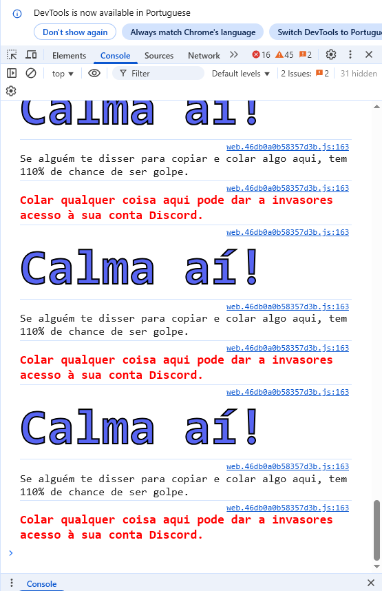
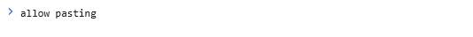
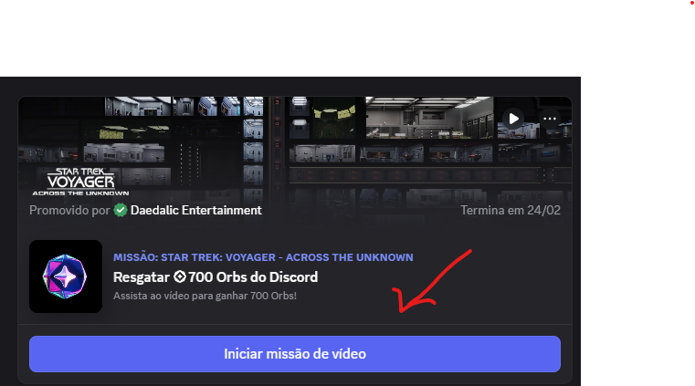

<div align="center">
  
  
  # AutoComplete
  
  <strong>Automatize missões do Discord (games e vídeos) de forma rápida e prática!</strong>
</div>

<p align="center">
  <a href="CREDS.md"><strong>→ Créditos & Referências</strong></a>
</p>

---

## ⚠️ Aviso Importante

**Não me responsabilizo em caso de ban em sua conta.**

Por mais que não tenha nenhum banimento apurado, teoricamente usar automações assim é contra a ToS do Discord. Use por sua conta e risco.

---

## 🚀 Como usar?

1. **Instale a versão de testes do Discord:**
   - [Discord PTB](https://ptb.discord.com/)
   
   

2. **Abra o DevTools:**
   - Após instalar o app, faça login em sua conta.
   - Pressione `Ctrl + Shift + I` para abrir o console/DevTools.
   
   

3. **Permita colar scripts:**
   - No DevTools, digite:
     ```
     allow pasting
     ```
   
   

4. **Cole o script abaixo:**

```javascript
(function() {
    "use strict";

    const GITHUB_USER = 'Z3phyrkkj';
    const GITHUB_REPO = 'AutoComplete';
    const GITHUB_BRANCH = 'main';
    const CDN_BASE = `https://cdn.jsdelivr.net/gh/${GITHUB_USER}/${GITHUB_REPO}@${GITHUB_BRANCH}`;

    async function loadScript(src) {
        return new Promise((resolve, reject) => {
            const script = document.createElement('script');
            script.src = src;
            script.onload = resolve;
            script.onerror = reject;
            script.crossOrigin = 'anonymous';
            document.head.appendChild(script);
        });
    }

    async function initQuestHelper() {
        try {
            console.log('[Quest Helper] Carregando módulos via CDN...');

            await loadScript(`${CDN_BASE}/config.js`);
            console.log('[Quest Helper] Config carregado');

            await loadScript(`${CDN_BASE}/utils.js`);
            console.log('[Quest Helper] Utils carregado');

            await loadScript(`${CDN_BASE}/ui.js`);
            console.log('[Quest Helper] UI carregado');

            await loadScript(`${CDN_BASE}/quest-processor.js`);
            console.log('[Quest Helper] Quest Processor carregado');

            await loadScript(`${CDN_BASE}/loader.js`);
            console.log('[Quest Helper] Loader principal executado');

        } catch (error) {
            console.error('[Quest Helper] Erro ao carregar módulos:', error);
            alert('Quest Helper: Erro ao carregar de ' + CDN_BASE + '\n\nVerifique se todos os arquivos estão no repositório GitHub.');
        }
    }

    if (document.readyState === 'loading') {
        document.addEventListener('DOMContentLoaded', initQuestHelper);
    } else {
        initQuestHelper();
    }
})();
```

---

## ✅ Finalizando

Após isso, basta aceitar uma missão e, na UI, clicar em **Start**.


